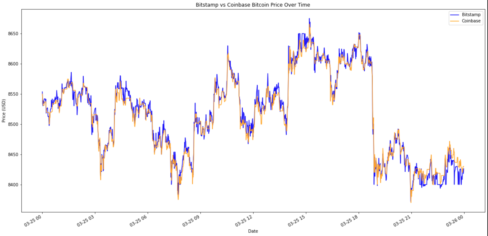

# crypto-arbitrage-opportunities
Using Python Pandas to see if users can take advantage of price variations in cryptocurrencies between different exchanges. Analyzes data and provides explanation for which days / windows are best to try and take advantage of. 

---

## Technologies

Technologies included are Pandas, Jupyter, csv, and pathlib.

---

## Installation Guide

N/A

---

## Usage

---

## Contributors

Name: Keenan Heller
Email: keenanaheller@gmail.com
LinkedIn: https://www.linkedin.com/in/keenanheller/
---

## License

MIT License
